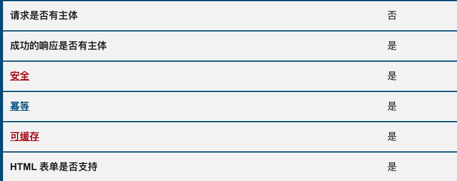
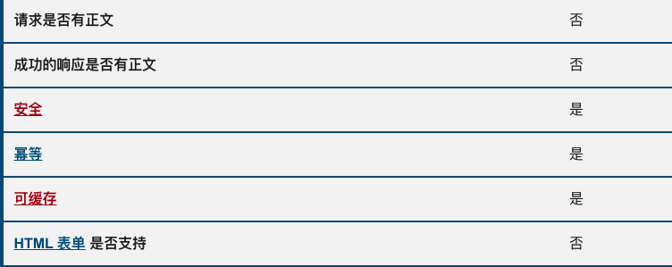
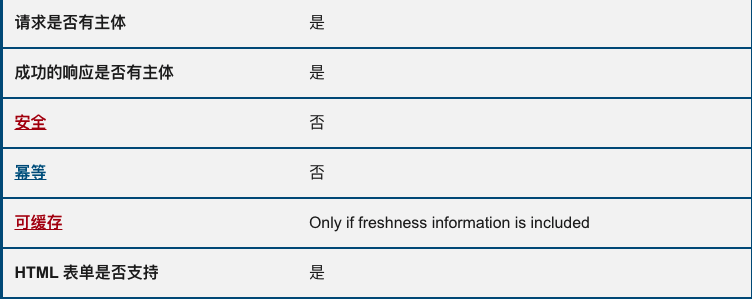
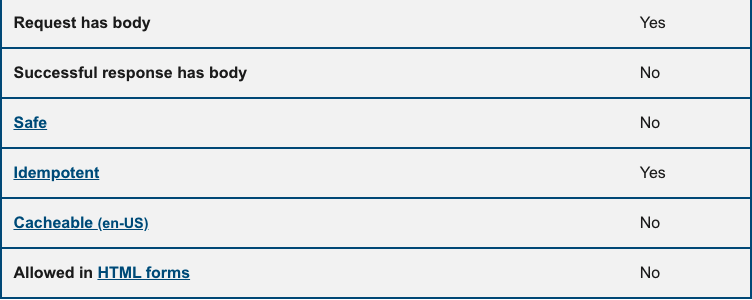
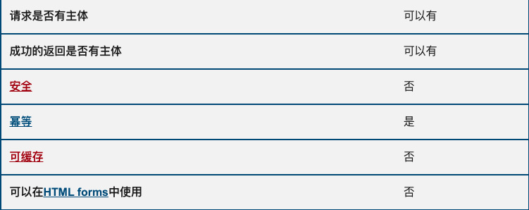
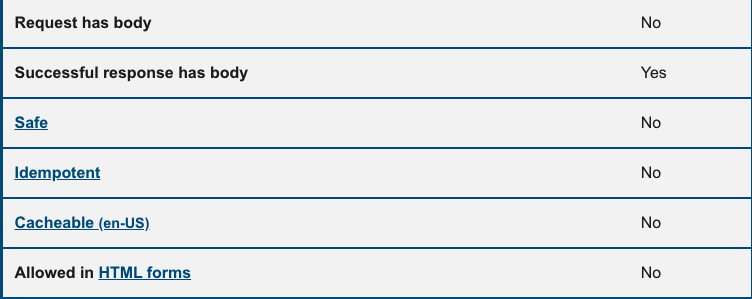
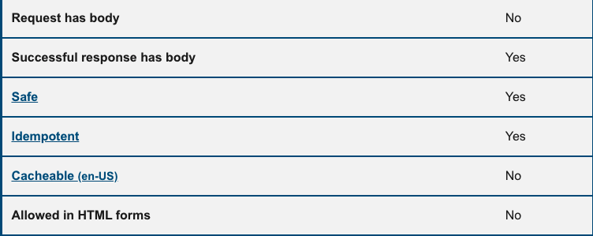
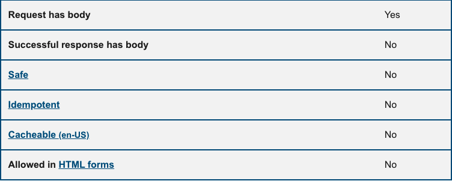

> https://developer.mozilla.org/zh-CN/docs/Web/HTTP/Methods

# HTTP 请求方法

幂等：指的是同样的请求被执行一次与连续执行多次的效果是一样的，服务器的状态也是一样的。

## `GET`

> `GET` 方法请求一个指定资源的表示形式，使用 GET 的请求应该只被用于获取数据。

- HTTP / 0.9

  

## `HEAD`

> `HEAD` 方法请求一个与 GET 请求的响应相同的响应，但没有响应体。

- HTTP / 1.0
- 使用场景：

  - 在下载一个大文件前先获取其大小再决定是否要下载, 以此可以节约带宽资源.
  - 多数浏览器在发送 `POST` 请求时，会先发送 `HEAD` 请求，Firefox 只发送一次

  

## `POST`

> `POST` 方法用于将实体提交到指定的资源，通常导致在服务器上的状态变化或副作用。

- HTTP / 1.0
- 幂等性：幂不等
- 支持的参数类型（content-type）：

  - `form-data`
  - `x-www-form-urlencoded` (默认)
  - `raw`
  - `binary`

  

## `PUT`

> `PUT` 方法用请求有效载荷替换目标资源的所有当前表示。

- HTTP / 1.1
- 如果目标资源不存在，并且 PUT 方法成功创建了一份，那么源头服务器必须返回 201 (Created) 来通知客户端资源已创建。
- 目标资源已经存在，并且依照请求中封装的表现形式成功进行了更新，那么，源头服务器必须返回 200 (OK) 或者 204 (No Content) 来表示请求的成功完成。
  

## `DELETE`

> `DELETE` 方法删除指定的资源。

- HTTP / 1.1
- 相关状态码：

  - 200(OK): 表示操作已执行，并且响应中提供了相关状态的描述信息。
  - 202(Accepted): 表示请求的操作可能会成功执行，但是尚未开始执行。
  - 204(No Content): 表示操作已执行，但是无进一步的相关信息。

  

## `CONNECT`

> `CONNECT` 方法建立一个到由目标资源标识的服务器的隧道。

- HTTP / 1.1
  

## `OPTIONS`

> `OPTIONS` 方法用于描述目标资源的通信选项。

- HTTP / 1.1
- 使用场景:
  - `CORS` 跨域请求资源时，会使用 `options`
  - 复杂请求会主动发起 options
- 简单请求和复杂请求

  - 简单请求：
    - `GET`，`HEAD`，`POST`
  - 复杂请求：

    - `DELETE`，`PUT`，`TRACE`，`PATCH`，`CONNECT`
    - `Content-Type` 的值不属于以下：`application/x-www-form-urlencoded`、`multipart/form-data`、`text/plain`

  

## `TRACE`

> `TRACE` 方法沿着到目标资源的路径执行一个消息环回测试。

- HTTP / 1.1

## `PATCH`

> `PATCH` 方法用于对资源应用**部分**修改。

- HTTP / 1.1
- 幂等性：非幂等
- 相关状态码:
  - `204(No Content)`:服务器成功处理了请求，但没返回任何内容。
    - `204` 与 `200` 的区别：
    - `200`: 如果导航到的 URL 返回了一个没有响应体的 `HTTP/200` 响应,则页面将会显示一个空白文档(就是一片白色).页面的 URL 地址也会变成新指定的 URL.
    - `204`: 如果服务器返回的是一个 `HTTP/204` 响应,当前页面不会有任何变化,就好像根本没有进行导航操作一样.页面的 URL 地址也保持不变.
- 与 PUT 的区别：

  - `PUT` 对资源进行整体覆盖
  - `PATCH` 对资源进行局部更改

  
