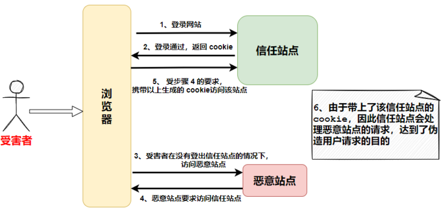

> https://segmentfault.com/a/1190000040517973

# Web 攻击类型

- XSS 攻击
- CSRF 攻击
- SQL 注入攻击
- DDOS 攻击
- 文件上传漏洞

## XSS 跨站脚本攻击(Cross Site Scripting)

1. 攻击原理

关键词：脚本  
使用表单提交讲 script 代码

2. 攻击类型：

- 存储形: 存储到数据库当中
- 反射性：受害者被引诱点击一个恶意链接，提交一个伪造的表单
- DOM-baesd

3. 如何防御：

- 字符串转义
- 设置 Header 中的 Content-Security-Policy,建立白名单
- 设置 httponly 属性

## CSRF 跨站请求伪造（Cross-Site Request Forgery）

1. 攻击原理

关键词：伪造  

1. 如何防御：

- 使用 token
- 验证 referer: 记录了该 Http 请求的来源地址
- 不让第三方网站访问 cookie

## SQL 注入

1. 攻击原理

通过把 SQL 命令伪装成正常的请求参数，传递到服务端，欺骗服务器最终执行恶意的 SQL 命令，达到入侵的目的。

## 文件上传漏洞

1. 攻击原理

攻击者利用一些站点没有对文件类型做很好的校验，上传了可执行的文件或脚本，并且通过脚本对服务器进行一定的权限操作，或是通过诱导外部用户访问该脚本文件，达到攻击的目的。

2. 如何防御：

通过`魔数`对文件类型进行判断，根据这几个字节的内容，就可以确定文件类型
